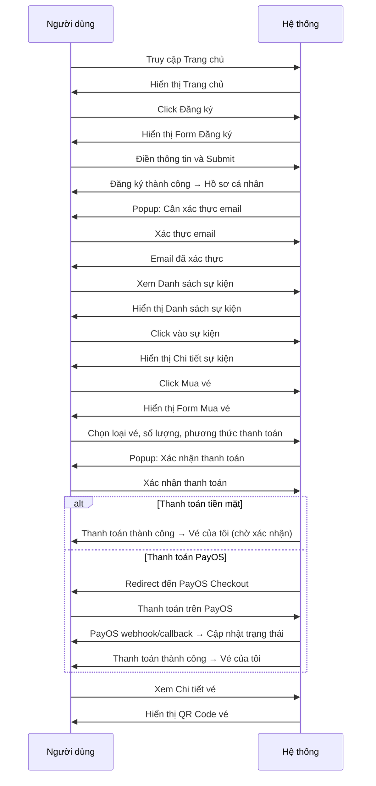
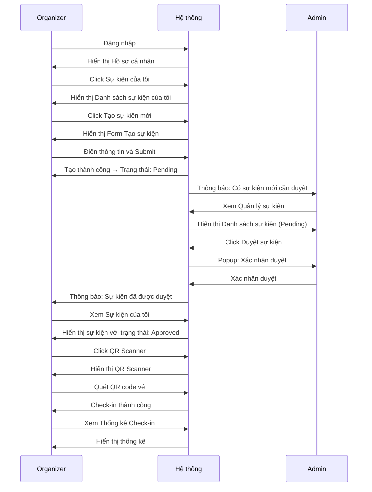
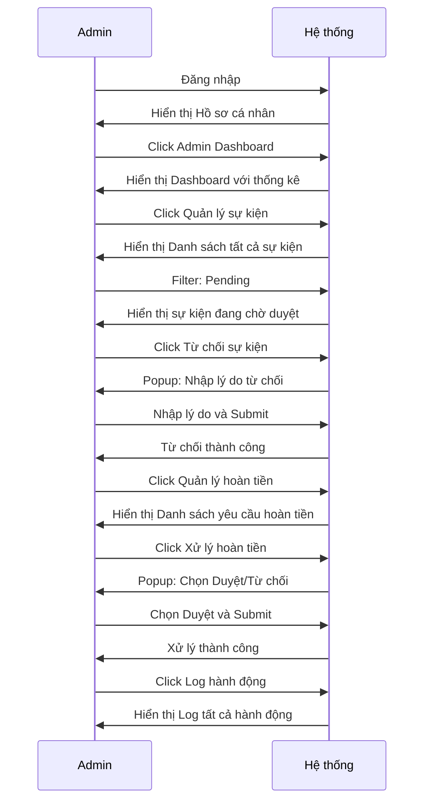

# DANH SÁCH CÁC SCREEN VÀ SCREEN FLOW
## Hệ thống quản lý sự kiện - Seniks Events Web

---

## 📋 DANH SÁCH CÁC SCREEN CẦN LÀM

### 🔓 PUBLIC SCREENS (Không cần đăng nhập)

1. **Trang chủ (Home/Welcome)**
   - Hiển thị thông tin giới thiệu
   - Danh sách sự kiện nổi bật
   - Link đến đăng nhập/đăng ký

2. **Đăng nhập (Login)**
   - Form đăng nhập với email và mật khẩu
   - Checkbox "Remember Me"
   - Link đến đăng ký và quên mật khẩu

3. **Đăng ký (Register)**
   - Form đăng ký: Họ tên, Email, Mật khẩu, Số điện thoại
   - Validation và thông báo lỗi
   - Link đến đăng nhập

4. **Quên mật khẩu (Forgot Password)**
   - Form nhập email để reset mật khẩu
   - Thông báo gửi email thành công
   - Link đến đăng nhập

5. **Đặt lại mật khẩu (Reset Password)**
   - Form nhập mật khẩu mới và xác nhận
   - Token từ email (signed URL)
   - Validation mật khẩu (tối thiểu 8 ký tự)
   - Thông báo thành công và redirect đến đăng nhập

6. **Danh sách sự kiện (Events List)**
   - Hiển thị danh sách sự kiện đã được duyệt
   - Filter: Danh mục, Địa điểm, Từ khóa, Khoảng thời gian
   - Phân trang (12 sự kiện/trang)
   - Link đến chi tiết sự kiện

7. **Chi tiết sự kiện (Event Detail)**
   - Thông tin cơ bản: Tiêu đề, Mô tả, Thời gian, Địa điểm
   - Thông tin người tổ chức
   - Danh sách loại vé và giá
   - Nút mua vé (nếu đã đăng nhập và xác thực email)
   - Nút yêu thích (nếu đã đăng nhập)
   - Đánh giá và bình luận
   - Tags liên quan

8. **Đánh giá sự kiện (Event Reviews)**
   - Danh sách đánh giá của sự kiện
   - Điểm trung bình
   - Form tạo đánh giá (nếu đã tham gia và sự kiện đã kết thúc)

9. **Danh sách danh mục (Categories)**
   - Hiển thị tất cả danh mục sự kiện

10. **Danh sách địa điểm (Locations)**
   - Hiển thị tất cả địa điểm

---

### 🔐 AUTHENTICATED USER SCREENS (Cần đăng nhập)

11. **Hồ sơ cá nhân (Profile/My Account)**
    - Xem thông tin tài khoản
    - Cập nhật thông tin: Tên, Số điện thoại, Avatar
    - Xác thực email (gửi lại email xác thực)
    - Đổi mật khẩu
    - Đăng xuất

12. **Vé của tôi (My Tickets)**
    - Danh sách vé đã mua (chỉ hiển thị vé của user hiện tại, kể cả admin)
    - Filter theo trạng thái
    - Link đến chi tiết vé

13. **Chi tiết vé (Ticket Detail)**
    - Thông tin sự kiện
    - Loại vé, Giá, Số lượng
    - Thời gian mua
    - Trạng thái thanh toán (pending, paid, used, cancelled)
    - QR Code (chỉ khi đã thanh toán)
    - Thời gian check-in (nếu đã check-in)
    - Link đến thông tin thanh toán

14. **Mua vé (Purchase Ticket)**
    - Chọn loại vé
    - Chọn số lượng (tối đa 10)
    - Chọn phương thức thanh toán (Tiền mặt, PayOS)
    - Xác nhận và thanh toán
    - Nếu chọn PayOS: Redirect đến PayOS checkout URL
    - Sau khi thanh toán PayOS thành công: Quay lại và cập nhật trạng thái vé

15. **Thanh toán của tôi (My Payments)**
    - Danh sách các giao dịch thanh toán
    - Filter theo trạng thái
    - Link đến chi tiết thanh toán

16. **Chi tiết thanh toán (Payment Detail)**
    - Thông tin vé
    - Số tiền, Phương thức thanh toán
    - Trạng thái thanh toán (success, failed, refunded)
    - Transaction ID
    - Thời gian thanh toán (paid_at)
    - Nút yêu cầu hoàn tiền (nếu đã thanh toán thành công)

17. **Sự kiện của tôi (My Events) - Organizer**
    - Danh sách sự kiện do mình tạo
    - Filter theo trạng thái (tất cả, đã kết thúc, đã hủy)
    - Nút tạo sự kiện mới
    - Link đến chỉnh sửa, xóa, yêu cầu hủy
    - Badge số lượng thanh toán chờ xác nhận

18. **Tạo sự kiện (Create Event) - Organizer**
    - Form tạo sự kiện: Tiêu đề, Mô tả, Thời gian, Danh mục, Địa điểm, Số lượng tối đa, Banner
    - Form tạo ticket types: Tên, Giá, Số lượng, Mô tả, Thời gian bán vé, Trạng thái
    - Validation
    - Lưu và gửi duyệt

19. **Chỉnh sửa sự kiện (Edit Event) - Organizer**
    - Form chỉnh sửa tương tự tạo sự kiện
    - Chỉnh sửa ticket types (thêm, sửa, xóa - chỉ khi chưa có vé được bán)
    - Chỉ cho phép khi sự kiện ở trạng thái cho phép chỉnh sửa

20. **Yêu thích (Favorites)**
    - Danh sách sự kiện đã yêu thích
    - Xóa khỏi yêu thích

21. **Gợi ý sự kiện (Recommendations)**
    - Danh sách sự kiện được gợi ý dựa trên yêu thích
    - Nếu chưa có yêu thích, hiển thị sự kiện phổ biến

22. **Thông báo (Notifications)**
    - Danh sách thông báo
    - Đánh dấu đã đọc
    - Đánh dấu tất cả đã đọc
    - Hiển thị số lượng chưa đọc

23. **QR Code vé (Ticket QR Code)**
    - Hiển thị QR code của vé
    - Tải xuống QR code
    - Thông tin vé và sự kiện

---

### 👨‍💼 ORGANIZER SCREENS (Chủ sự kiện)

24. **Organizer Dashboard**
    - Tổng số sự kiện
    - Số sự kiện đã duyệt/chờ duyệt
    - Tổng số thanh toán tiền mặt chờ xác nhận
    - Tổng số vé đã bán
    - Tổng doanh thu
    - Sự kiện sắp diễn ra (7 ngày tới)
    - Sự kiện có thanh toán chờ xác nhận
    - Sự kiện gần đây

25. **QR Scanner (QR Scanner) - Organizer**
    - Giao diện quét QR code
    - Quét và check-in vé cho người tham gia
    - Hiển thị thông tin vé sau khi quét
    - Thông báo kết quả check-in (thành công/lỗi)

26. **Thống kê Check-in (Check-in Stats) - Organizer**
    - Tổng số vé đã bán (tính theo quantity)
    - Số vé đã check-in
    - Số vé chưa check-in
    - Tỷ lệ check-in (%)

27. **Danh sách người tham gia (Attendees List) - Organizer**
    - Danh sách tất cả người đã mua vé (không chỉ đã check-in)
    - Thông tin: Tên, Email, Loại vé, Số lượng, Giá, Thời gian mua
    - Trạng thái check-in (đã check-in/chưa check-in)
    - Thời gian check-in (nếu đã check-in)
    - Tổng doanh thu của sự kiện

28. **Thanh toán tiền mặt chờ xác nhận (Pending Cash Payments) - Organizer**
    - Danh sách thanh toán tiền mặt chờ xác nhận
    - Thông tin: Người mua, Số lượng vé, Số tiền, Thời gian mua
    - Nút xác nhận nhận tiền
    - Nút từ chối thanh toán
    - Badge hiển thị số lượng chờ xác nhận

---

### 🔧 ADMIN SCREENS (Quản trị viên)

29. **Admin Dashboard**
    - Layout riêng với sidebar navigation
    - Tổng số người dùng
    - Tổng số sự kiện
    - Số sự kiện đang chờ duyệt
    - Tổng số vé đã bán
    - Tổng doanh thu
    - Danh sách sự kiện đang chờ duyệt (pending events)
    - Danh sách thanh toán gần đây (recent payments)
    - Top 10 sự kiện có doanh thu cao nhất

30. **Quản lý sự kiện (Admin Events)**
    - Danh sách tất cả sự kiện
    - Tìm kiếm theo tiêu đề, mô tả, tên/email organizer
    - Filter theo trạng thái duyệt (pending, approved, rejected)
    - Filter theo trạng thái sự kiện (upcoming, ongoing, ended, cancelled)
    - Hiển thị doanh thu hiện tại của từng sự kiện
    - Nút duyệt/từ chối sự kiện
    - Nút duyệt/từ chối yêu cầu hủy
    - Xem chi tiết sự kiện
    - Xóa sự kiện (soft delete)

31. **Quản lý người dùng (Admin Users)**
    - Danh sách tất cả người dùng
    - Tìm kiếm theo tên hoặc email
    - Filter theo vai trò (role)
    - Nút xem chi tiết người dùng
    - Cập nhật vai trò người dùng
    - Xóa người dùng

32. **Quản lý thanh toán (Admin Payments)**
    - Danh sách tất cả thanh toán
    - Filter theo trạng thái (success, failed, refunded)
    - Tìm kiếm theo Transaction ID, tên, email
    - Xem chi tiết thanh toán

33. **Quản lý vé (Admin Tickets)**
    - Danh sách tất cả vé
    - Filter theo trạng thái thanh toán (pending, paid, used, cancelled)
    - Tìm kiếm theo QR code, tên, email, sự kiện
    - Xem chi tiết vé

34. **Quản lý danh mục (Admin Categories)**
    - Danh sách tất cả danh mục
    - Form tạo/sửa danh mục
    - Xóa danh mục (nếu không có sự kiện sử dụng)
    - Hiển thị số lượng sự kiện của mỗi danh mục

35. **Quản lý địa điểm (Admin Locations)**
    - Danh sách tất cả địa điểm
    - Form tạo/sửa địa điểm
    - Xóa địa điểm (nếu không có sự kiện sử dụng)
    - Hiển thị số lượng sự kiện của mỗi địa điểm

36. **Quản lý hoàn tiền (Admin Refunds)**
    - Danh sách tất cả yêu cầu hoàn tiền
    - Filter theo trạng thái (pending, approved, rejected)
    - Xử lý yêu cầu hoàn tiền
    - Xem chi tiết yêu cầu

37. **Log hành động (Admin Logs)**
    - Danh sách log tất cả hành động quản trị
    - Filter theo hành động, người thực hiện, thời gian
    - Xem chi tiết log

38. **Chi tiết người dùng (User Detail) - Admin**
    - Thông tin cơ bản: Tên, Email, Avatar, Vai trò
    - Thống kê: Tổng số sự kiện đã tổ chức, Tổng số vé đã mua, Tổng số đánh giá, Tổng chi tiêu
    - Tab: Sự kiện đã tổ chức, Vé đã mua, Thanh toán, Đánh giá, Sự kiện yêu thích

---

### 🔔 POPUPS/MODALS

1. **Xác nhận xóa sự kiện (Confirm Delete Event)**
   - Xác nhận trước khi xóa sự kiện

2. **Xác nhận yêu cầu hoàn tiền (Confirm Refund Request)**
   - Form nhập lý do hoàn tiền (bắt buộc, tối đa 255 ký tự)
   - Xác nhận gửi yêu cầu

3. **Xác nhận thanh toán (Confirm Payment)**
   - Xác nhận thông tin thanh toán trước khi thanh toán

4. **Xác thực email (Email Verification)**
   - Thông báo cần xác thực email
   - Nút gửi lại email xác thực

5. **Thông báo thành công/Lỗi (Success/Error Messages)**
   - Hiển thị thông báo sau các hành động

6. **Duyệt/Từ chối sự kiện (Approve/Reject Event) - Admin**
   - Form nhập lý do từ chối (nếu từ chối)
   - Xác nhận duyệt/từ chối

7. **Cập nhật vai trò người dùng (Update User Role) - Admin**
   - Form chọn vai trò mới
   - Xác nhận cập nhật

8. **Xử lý hoàn tiền (Process Refund) - Admin**
   - Form nhập quyết định (duyệt/từ chối)
   - Form nhập ghi chú
   - Xác nhận xử lý

9. **Xác nhận nhận tiền (Confirm Cash Payment) - Organizer**
   - Xác nhận trước khi xác nhận nhận tiền mặt
   - Cập nhật trạng thái thanh toán và vé
   - Gửi email và thông báo cho người mua

10. **Từ chối thanh toán tiền mặt (Reject Cash Payment) - Organizer**
   - Xác nhận trước khi từ chối thanh toán
   - Cập nhật trạng thái vé = "cancelled"
   - Hoàn lại số lượng vé cho ticket type
   - Gửi thông báo cho người mua

11. **Yêu cầu hủy sự kiện (Request Event Cancellation) - Organizer**
   - Form nhập lý do hủy (tối thiểu 10 ký tự, tối đa 1000 ký tự)
   - Xác nhận gửi yêu cầu
   - Gửi thông báo cho admin

12. **Duyệt/Từ chối yêu cầu hủy (Approve/Reject Cancellation) - Admin**
   - Xác nhận duyệt/từ chối yêu cầu hủy
   - Nếu duyệt: Cập nhật status = "cancelled", gửi thông báo cho organizer và attendees
   - Nếu từ chối: Xóa yêu cầu, gửi thông báo cho organizer

---

## 📊 SCREEN FLOW DIAGRAM

```mermaid
flowchart TD
    Start([Bắt đầu]) --> Home[Trang chủ]
    
    %% Public Flow
    Home --> Login[Đăng nhập]
    Home --> Register[Đăng ký]
    Home --> EventsList[Danh sách sự kiện]
    Home --> Categories[Danh sách danh mục]
    Home --> Locations[Danh sách địa điểm]
    
    Login --> ForgotPassword[Quên mật khẩu]
    Login --> Home
    Register --> Home
    ForgotPassword --> Login
    
    EventsList --> EventDetail[Chi tiết sự kiện]
    EventDetail --> EventReviews[Đánh giá sự kiện]
    EventDetail --> PurchaseTicket[Mua vé]
    EventDetail --> AddFavorite[Thêm yêu thích]
    
    %% Authenticated User Flow
    Login -->|Đăng nhập thành công| Profile[Hồ sơ cá nhân]
    Register -->|Đăng ký thành công| Profile
    
    Profile --> MyTickets[Vé của tôi]
    Profile --> MyPayments[Thanh toán của tôi]
    Profile --> MyEvents[Sự kiện của tôi]
    Profile --> Favorites[Yêu thích]
    Profile --> Recommendations[Gợi ý sự kiện]
    Profile --> Notifications[Thông báo]
    
    MyTickets --> TicketDetail[Chi tiết vé]
    TicketDetail --> TicketQR[QR Code vé]
    
    MyPayments --> PaymentDetail[Chi tiết thanh toán]
    PaymentDetail --> RefundRequest[Yêu cầu hoàn tiền]
    
    MyEvents --> CreateEvent[Tạo sự kiện]
    MyEvents --> EditEvent[Chỉnh sửa sự kiện]
    MyEvents --> QRScanner[QR Scanner]
    MyEvents --> CheckinStats[Thống kê Check-in]
    MyEvents --> AttendeesList[Danh sách người tham gia]
    
    PurchaseTicket --> PaymentConfirm[Xác nhận thanh toán]
    PaymentConfirm -->|Thanh toán tiền mặt| MyTickets
    PaymentConfirm -->|Thanh toán PayOS| PayOSCheckout[PayOS Checkout]
    PayOSCheckout -->|Thanh toán thành công| PayOSReturn[PayOS Return URL]
    PayOSReturn --> MyTickets
    PayOSCheckout -->|Hủy thanh toán| PayOSCancel[PayOS Cancel URL]
    PayOSCancel --> PurchaseTicket
    
    CreateEvent -->|Tạo thành công| MyEvents
    EditEvent -->|Cập nhật thành công| MyEvents
    
    %% Organizer Flow
    Profile -->|Nếu là Organizer| OrganizerDashboard[Organizer Dashboard]
    MyEvents --> OrganizerDashboard
    OrganizerDashboard --> PendingCashPayments[Thanh toán tiền mặt chờ xác nhận]
    PendingCashPayments --> ConfirmCashPayment[Xác nhận nhận tiền]
    
    %% Admin Flow
    Profile -->|Nếu là Admin| AdminDashboard[Admin Dashboard]
    AdminDashboard --> AdminEvents[Quản lý sự kiện]
    AdminDashboard --> AdminUsers[Quản lý người dùng]
    AdminUsers --> UserDetail[Chi tiết người dùng]
    AdminDashboard --> AdminPayments[Quản lý thanh toán]
    AdminDashboard --> AdminTickets[Quản lý vé]
    AdminDashboard --> AdminCategories[Quản lý danh mục]
    AdminDashboard --> AdminLocations[Quản lý địa điểm]
    AdminDashboard --> AdminRefunds[Quản lý hoàn tiền]
    AdminDashboard --> AdminLogs[Log hành động]
    
    AdminEvents --> ApproveRejectEvent[Duyệt/Từ chối sự kiện]
    AdminUsers --> UpdateUserRole[Cập nhật vai trò]
    AdminRefunds --> ProcessRefund[Xử lý hoàn tiền]
    
    %% Popups/Modals
    EditEvent -.->|Xóa| ConfirmDeleteEvent((Xác nhận xóa sự kiện))
    RefundRequest -.->|Gửi yêu cầu| ConfirmRefundRequest((Xác nhận yêu cầu hoàn tiền))
    PaymentConfirm -.->|Xác nhận| ConfirmPayment((Xác nhận thanh toán))
    Profile -.->|Chưa xác thực| EmailVerification((Xác thực email))
    ApproveRejectEvent -.->|Từ chối| RejectEventModal((Nhập lý do từ chối))
    UpdateUserRole -.->|Cập nhật| UpdateRoleModal((Chọn vai trò mới))
    ProcessRefund -.->|Xử lý| ProcessRefundModal((Quyết định hoàn tiền))
    
    %% Success/Error Messages
    ConfirmDeleteEvent -.-> SuccessErrorMsg((Thông báo thành công/Lỗi))
    ConfirmRefundRequest -.-> SuccessErrorMsg
    ConfirmPayment -.-> SuccessErrorMsg
    EmailVerification -.-> SuccessErrorMsg
    RejectEventModal -.-> SuccessErrorMsg
    UpdateRoleModal -.-> SuccessErrorMsg
    ProcessRefundModal -.-> SuccessErrorMsg
    
    %% Styling - Screens (Rectangles)
    classDef screenStyle fill:#e1f5ff,stroke:#01579b,stroke-width:2px
    class Home,Login,Register,ForgotPassword,EventsList,EventDetail,EventReviews,PurchaseTicket,Profile,MyTickets,TicketDetail,TicketQR,MyPayments,PaymentDetail,MyEvents,CreateEvent,EditEvent,Favorites,Recommendations,Notifications,OrganizerDashboard,PendingCashPayments,QRScanner,CheckinStats,AttendeesList screenStyle
    
    %% Styling - Popups (Ovals)
    classDef popupStyle fill:#fff9c4,stroke:#f57f17,stroke-width:2px
    class ConfirmDeleteEvent,ConfirmRefundRequest,ConfirmPayment,EmailVerification,RejectEventModal,UpdateRoleModal,ProcessRefundModal,ConfirmCashPaymentModal,SuccessErrorMsg popupStyle
    
    %% Styling - Admin Screens
    classDef adminStyle fill:#f3e5f5,stroke:#4a148c,stroke-width:2px
    class AdminDashboard,AdminEvents,AdminUsers,AdminPayments,AdminTickets,AdminCategories,AdminLocations,AdminRefunds,AdminLogs,ApproveRejectEvent,UpdateUserRole,ProcessRefund adminStyle
    
    %% Styling - Popups
    ConfirmCashPayment -.->|Xác nhận| ConfirmCashPaymentModal((Xác nhận nhận tiền))
    ConfirmCashPaymentModal -.-> SuccessErrorMsg
```

---

## 🔄 USER JOURNEY FLOWS

### Flow 1: Người dùng mới đăng ký và mua vé

### Flow 2: Organizer tạo và quản lý sự kiện

### Flow 3: Admin quản lý hệ thống

---

## 📝 GHI CHÚ

- **Hình chữ nhật**: Biểu thị các Screen chính
- **Hình bầu dục**: Biểu thị các Popup/Modal
- **Mũi tên liền**: Điều hướng giữa các Screen
- **Mũi tên đứt nét**: Mở Popup/Modal từ Screen
- **Màu xanh dương**: Screen thông thường
- **Màu vàng**: Popup/Modal
- **Màu tím**: Screen dành cho Admin

---

**Tài liệu này được tạo dựa trên phân tích routes và functional requirements của hệ thống.**

